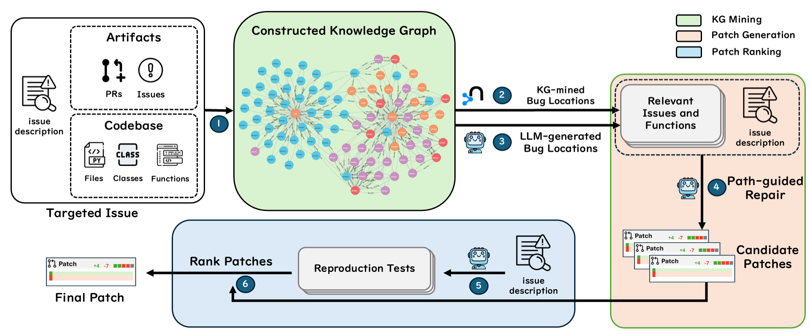

# KGCompass
<div align="center">

[](LICENSE)
[](https://www.python.org/)
[](https://arxiv.org/abs/2503.21710)
[](https://www.docker.com/)

</div>

KGCompass is a novel approach for repository-level software repair that accurately links code structure with repository metadata using a knowledge graph, enabling more precise bug localization and patch generation.

Paper link: https://arxiv.org/abs/2503.21710



## Fully Containerized Workflow with GPU Support

This project uses Docker and Docker Compose to provide a fully reproducible environment. The setup includes:
- A base image with CUDA and Python pre-installed.
- A service for the Neo4j database with necessary plugins.
- An application service with all Python dependencies and access to the host's GPU.

### Prerequisites

1.  **NVIDIA GPU & Drivers**: A compatible NVIDIA GPU with recent drivers installed on your host machine.
2.  **NVIDIA Container Toolkit**: You must install this on your host to allow Docker to use the GPU. For Debian/Ubuntu-based systems, you can do so by running the following command block in your terminal:
    ```bash
    curl -fsSL https://nvidia.github.io/libnvidia-container/gpgkey | sudo gpg --dearmor -o /usr/share/keyrings/nvidia-container-toolkit-keyring.gpg \
    && curl -s -L https://nvidia.github.io/libnvidia-container/stable/deb/nvidia-container-toolkit.list | \
      sed 's#deb https://#deb [signed-by=/usr/share/keyrings/nvidia-container-toolkit-keyring.gpg] https://#g' | \
      sudo tee /etc/apt/sources.list.d/nvidia-container-toolkit.list \
    && sudo apt-get update \
    && sudo apt-get install -y nvidia-container-toolkit \
    && sudo nvidia-ctk runtime configure --runtime=docker \
    && sudo systemctl restart docker
    ```
3.  **Docker & Docker Compose**: This project uses Docker Compose V1.
    *   Ensure Docker is installed on your system.
    *   Install Docker Compose V1 (if not already present) by running:
    ```bash
    LATEST_COMPOSE_V1="1.29.2"
    sudo curl -L "https://github.com/docker/compose/releases/download/${LATEST_COMPOSE_V1}/docker-compose-$(uname -s)-$(uname -m)" -o /usr/local/bin/docker-compose
    sudo chmod +x /usr/local/bin/docker-compose
    ```
4.  **API Keys**: Create a `.env` file in the project root by copying the example:
    ```bash
    cp .env.example .env
    ```
    Then, edit the `.env` file and fill in your `GITHUB_TOKEN`, and `BAILIAN_API_KEY`.

**Step 1: Build and Start All Services**

This single command will build the base CUDA image, the Neo4j image, and the final application image, then start all services in the background.

```bash
docker-compose up -d --build
```

**Step 2: Run the Repair Pipeline**

Execute the repair script *inside* the application container. The container will have access to the GPU.

```bash
docker-compose exec app bash run_repair.sh <instance_id>

# Example:
docker-compose exec app bash run_repair.sh astropy__astropy-12907
```

**Step 3: Stopping the Environment**
```bash
docker-compose down -v
```

## Bulk KG Mining for SWE-bench_Verified

This repository provides `mine_kg_bulk.sh` to automatically iterate over every instance in the **SWE-bench_Verified** dataset and generate only the knowledge-graph (KG) bug-location predictions (pipeline *step 1*).

### Prerequisites
1.  Install `jq` for parsing JSON lines (e.g., `sudo apt-get install -y jq`).
2.  Download **SWE-bench_Verified** (JSONL) to your local machine.

### Usage

#### Run inside Docker Compose

First build and start all services (Neo4j and app container):

```bash
docker-compose up -d --build
```

Then execute the bulk KG mining script *inside* the running app container:

```bash
docker-compose exec app bash mine_kg_bulk.sh SWE-bench_Verified.jsonl
# 或者指定输出目录
# docker-compose exec app bash mine_kg_bulk.sh SWE-bench_Verified.jsonl /tmp/kg_verified
```

The `SWE-bench_Verified.jsonl` file should reside in the project root so that it is
visible inside the container at `/opt/KGCompass/` (the repository is mounted
as a volume).

Feel free to tweak proxy settings inside the script if you are behind a firewall.

#### Use HuggingFace API (no local JSONL needed)

```bash
# 在容器内直接运行：
docker-compose exec app python mine_kg_hf.py

# 指定数据集名称、split 或处理条数（调试用）
# docker-compose exec app python mine_kg_hf.py --dataset princeton-nlp/SWE-bench_Verified --split test --limit 10
```

脚本会通过 `datasets` 库加载 HuggingFace 上的 **SWE-bench_Verified**，无需下载 jsonl。同时也避免对 `jq` 的依赖。

#### Offline workflow using local JSONL

1. 在宿主机生成仅含 `instance_id` 的 JSONL（一次即可）：
   ```bash
   python prepare_verified_jsonl.py   # 生成 SWE-bench_Verified_ids.jsonl
   ```
2. 把生成的文件放到项目根目录（已被挂载到容器 `/opt/KGCompass/`）。
3. 在容器内使用纯 Python 脚本执行批量 KG 挖掘（无 `jq` 依赖）：
   ```bash
   docker-compose exec app python mine_kg_bulk.py SWE-bench_Verified_ids.jsonl
   ```

## Citation

If you use **KGCompass** in your research, please cite the following paper:

```bibtex
@article{yang2025enhancing,
  title={Enhancing Repository-Level Software Repair via Repository-Aware Knowledge Graphs},
  author={Yang, Boyang and Tian, Haoye and Ren, Jiadong and Jin, Shunfu and Liu, Yang and Liu, Feng and Le, Bach},
  journal={arXiv preprint arXiv:2503.21710},
  year={2025}
}
```

> **Permission Denied when writing KG JSON**
> 
> 如果容器内写文件时报 `PermissionError: ... runs/kg_verified/... .json`，多半是因为容器用户 ID 与宿主机文件属主不匹配。
> 
> 解决：在 `docker-compose.yml` 的 `app` 服务下加入
> ```yaml
> user: "${HOST_UID:-1000}:${HOST_GID:-1000}"
> ```
> 然后在宿主机执行：
> ```bash
> export HOST_UID=$(id -u)
> export HOST_GID=$(id -g)
> docker-compose down
> docker-compose up -d --build
> ```
> 这样容器进程将以与你相同的 UID/GID 运行，确保对挂载卷拥有读写权限。
