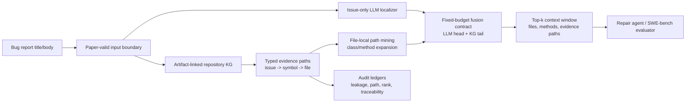

# KGCompass

[](requirements.txt)
[](LICENSE)
[](artifacts/RESULT_TRACEABILITY.md)
[](artifacts/README.md)
[](artifacts/scripts/verify_paper_results.py)

KGCompass is an evidence-grounded context-fusion system for repository-level bug
localization and repair. It combines issue-only LLM localization with a
repository knowledge graph, typed evidence paths, and file-local path mining to
construct a fixed-budget repair context window.

This repository is the public artifact branch. It intentionally keeps only the
demo, the core scripts, and the paper-facing experiment ledgers needed to audit
the manuscript claims. Large per-instance run directories, local SWE-bench
checkouts, and generated web outputs are not tracked.

## Method Overview


```mermaid
flowchart LR
    A["Bug report title/body"] --> B["Paper-valid input boundary"]
    B --> C1["Issue-only LLM localizer"]
    B --> C2["Artifact-linked repository KG"]
    C2 --> D["Typed evidence paths<br/>issue -> symbol -> file"]
    D --> E["File-local path mining<br/>class/method expansion"]
    C1 --> F["Fixed-budget fusion contract<br/>LLM head + KG tail"]
    E --> F
    F --> G["Top-k context window<br/>files, methods, evidence paths"]
    G --> H["Repair agent / SWE-bench evaluator"]
    D --> I["Audit ledgers<br/>leakage, path, rank, traceability"]
```

KGCompass excludes benchmark hints, issue/PR comments, target fixing pull
requests, patch diffs, linked commits, and future fixing artifacts from the
paper-valid localization setting. The final leakage audit reports 500/500 valid
instances with zero target-PR hits, zero future-fix hits, and zero content or
metadata failures.

## Repository Layout

| Path | Purpose |
| --- | --- |
| `app.py`, `demo_web.py`, `static/`, `templates/` | Local web demo. |
| `kgcompass/` | Core KGCompass localization and repair modules. |
| `scripts/` | Workspace scripts for finalizing KG localization and summaries. |
| `artifacts/` | Submission-side result ledgers, prompts, audit notes, and verifier scripts. |
| `artifacts/results/` | Committed tables and JSON/JSONL ledgers used by the manuscript. |
| `artifacts/RESULT_TRACEABILITY.md` | Source-to-claim mapping and full reproduction command log. |

## Quick Start

Create a Python environment:

```bash
python3 -m venv .venv
source .venv/bin/activate
pip install -r requirements.txt
```

Run the lightweight artifact verifier:

```bash
python3 artifacts/scripts/verify_paper_results.py
```

Expected result:

```json
{
  "ok": true,
  "scope": "all",
  "checked_values": 121,
  "failed": []
}
```

Rebuild the exploratory RQ3 path/rank audit summaries from the anonymized
observation ledgers:

```bash
python3 artifacts/scripts/rebuild_rq3_path_rank_audit.py
```

## Web Demo

Install the smaller web-demo dependency set if you only want to run the UI:

```bash
pip install -r requirements_web.txt
python3 demo_web.py
```

Or start the Flask app directly:

```bash
python3 app.py
```

The web app writes generated outputs to `web_outputs/` at runtime. Those outputs
are intentionally ignored by the repository.

## Reproducing the Paper Results

There are two levels of reproduction:

1. `Artifact ledger verification` runs from this repository alone and checks the
   committed paper-facing results.
2. `Full experiment reruns` require the full KGCompass experiment workspace:
   SWE-bench Verified caches, base-commit repositories, issue-only LLM output
   directories, path-mined KG run directories, and official SWE-bench evaluator
   infrastructure. The exact source paths and command history are indexed in
   `artifacts/RESULT_TRACEABILITY.md`.

### RQ1: Context-Window Localization

Paper-side verification:

```bash
python3 artifacts/scripts/verify_paper_results.py --rq rq1
```

Full workspace rerun for the main path-mined KGCompass localization table and
paired statistics:

```bash
python3 artifacts/scripts/export_path_mined_filelocal.py \
  --input-dir runs/kg_verified_evidence_graph/tse_timesafe_main_20260529_v6 \
  --output-dir runs/kg_verified_evidence_graph/tse_timesafe_main_20260531_pathsource_v1 \
  --limit 50

python3 artifacts/scripts/fuse_path_mined_with_kg.py \
  --kg-dir runs/kg_verified_evidence_graph/tse_timesafe_main_20260529_v6 \
  --path-mined-dir runs/kg_verified_evidence_graph/tse_timesafe_main_20260531_pathsource_v1 \
  --output-dir runs/kg_verified_evidence_graph/tse_timesafe_main_20260531_pathunion_v1 \
  --limit 50

python3 artifacts/scripts/eval_controls_v3.py \
  --group full_pathmined=runs/kg_verified_evidence_graph/tse_timesafe_main_20260531_pathunion_v1 \
  --group strict_kg_ablation=runs/kg_verified_evidence_graph/tse_timesafe_main_20260529_v6 \
  --group bm25_nohint=runs/text_baselines_nohints/2000 \
  --group dpr_filefirst=runs/text_baselines_dense_filefirst/2203 \
  --group bluir=runs/text_baselines_bluir/2300 \
  --group no_history_codegraph=runs/codegraph_anchor/tse_timesafe_main_20260531_v2 \
  --output-tsv logs/comparison_current/path_mining_file_expansion_ablation_20260531.tsv \
  --top-k 20

python3 artifacts/scripts/analyze_rq1_paired_stats.py \
  --main full_pathmined=runs/kg_verified_evidence_graph/tse_timesafe_main_20260531_pathunion_v1 \
  --baseline strict_kg_ablation=runs/kg_verified_evidence_graph/tse_timesafe_main_20260529_v6 \
  --baseline bm25_nohint=runs/text_baselines_nohints/2000 \
  --baseline dpr_filefirst=runs/text_baselines_dense_filefirst/2203 \
  --baseline bluir=runs/text_baselines_bluir/2300 \
  --output-tsv logs/comparison_current/rq1_pathmined_paired_stats_20260531.tsv
```

### RQ2: LLM + KGCompass Fusion

Paper-side verification:

```bash
python3 artifacts/scripts/verify_paper_results.py --rq rq2
```

Full workspace rerun for the fixed 10+10 LLM/KG fusion contract:

```bash
for spec in \
  "GLM5|temp_run/eval_aliyun_glm5_issueonly|GLM5_issue_only|GLM5_KG_pathmined_ht10" \
  "Qwen3CoderNext|temp_run/eval_aliyun_qwen3coderplus_issueonly|Qwen3CoderNext_issue_only|Qwen3CoderNext_KG_pathmined_ht10" \
  "MoonshotKimiK25|temp_run/eval_moonshot_kimik25_issueonly_w1|MoonshotKimiK25_issue_only|MoonshotKimiK25_KG_pathmined_ht10" \
  "Sonnet46|temp_run/eval_zenmux_sonnet46_issueonly_full|Sonnet46_issue_only|Sonnet46_KG_pathmined_ht10"; do
  IFS='|' read -r tag issue_dir issue_group fusion_group <<< "$spec"
  python3 temp_run/export_two_way_fusion.py \
    --primary-dir "$issue_dir" \
    --secondary-dir runs/kg_verified_evidence_graph/tse_timesafe_main_20260531_pathunion_v1 \
    --output-dir "temp_run/fusions_pathmined_kg/${tag}_pathunion_ht10" \
    --mode intersection \
    --strategy head_tail \
    --top-k 50 \
    --primary-head 10 \
    --secondary-head 10 \
    --force
done

python3 artifacts/scripts/eval_controls_v3.py \
  --ids-file temp_run/SWE-bench_Verified_ids.jsonl \
  --group GLM5_issue_only=temp_run/eval_aliyun_glm5_issueonly \
  --group GLM5_KG_pathmined_ht10=temp_run/fusions_pathmined_kg/GLM5_pathunion_ht10 \
  --group Qwen3CoderNext_issue_only=temp_run/eval_aliyun_qwen3coderplus_issueonly \
  --group Qwen3CoderNext_KG_pathmined_ht10=temp_run/fusions_pathmined_kg/Qwen3CoderNext_pathunion_ht10 \
  --group MoonshotKimiK25_issue_only=temp_run/eval_moonshot_kimik25_issueonly_w1 \
  --group MoonshotKimiK25_KG_pathmined_ht10=temp_run/fusions_pathmined_kg/MoonshotKimiK25_pathunion_ht10 \
  --group Sonnet46_issue_only=temp_run/eval_zenmux_sonnet46_issueonly_full \
  --group Sonnet46_KG_pathmined_ht10=temp_run/fusions_pathmined_kg/Sonnet46_pathunion_ht10 \
  --output-tsv logs/comparison_current/llm_pathmined_kg_ht10_20260531.tsv \
  --top-k 20

OUT_ROOT=temp_run/fusions_glm5_baseline_controls_20260614_head10
PRIMARY=temp_run/eval_aliyun_glm5_issueonly

while IFS="|" read -r name dir; do
  python3 temp_run/export_two_way_fusion.py \
    --primary-dir "$PRIMARY" \
    --secondary-dir "$dir" \
    --output-dir "$OUT_ROOT/$name" \
    --mode intersection \
    --strategy head_tail \
    --top-k 50 \
    --primary-head 10 \
    --secondary-head 10 \
    --force
done <<'EOF'
GLM5_BM25_ht10|runs/text_baselines_nohints/2000
GLM5_DPR_ht10|runs/text_baselines_dense_filefirst/2203
GLM5_BLUiR_ht10|runs/text_baselines_bluir/2300
GLM5_CodeGraph_ht10|runs/codegraph_anchor/tse_timesafe_main_20260531_v2
GLM5_RegexFileExpand_ht10|runs/regex_fileexpand_strict/tse_timesafe_main_20260531_v1
GLM5_LocalPathRank_ht10|runs/kg_verified_evidence_graph/tse_timesafe_main_20260531_pathsource_v1
GLM5_KGCompass_ht10|runs/kg_verified_evidence_graph/tse_timesafe_main_20260531_pathunion_v1
EOF

python3 artifacts/scripts/analyze_glm5_baseline_fusion_controls.py \
  --ids-file temp_run/SWE-bench_Verified_ids.jsonl \
  --issue-dir temp_run/eval_aliyun_glm5_issueonly \
  --group GLM5_BM25_ht10=$OUT_ROOT/GLM5_BM25_ht10 \
  --group GLM5_DPR_ht10=$OUT_ROOT/GLM5_DPR_ht10 \
  --group GLM5_BLUiR_ht10=$OUT_ROOT/GLM5_BLUiR_ht10 \
  --group GLM5_CodeGraph_ht10=$OUT_ROOT/GLM5_CodeGraph_ht10 \
  --group GLM5_RegexFileExpand_ht10=$OUT_ROOT/GLM5_RegexFileExpand_ht10 \
  --group GLM5_LocalPathRank_ht10=$OUT_ROOT/GLM5_LocalPathRank_ht10 \
  --group GLM5_KGCompass_ht10=$OUT_ROOT/GLM5_KGCompass_ht10 \
  --output-tsv logs/comparison_current/glm5_baseline_fusion_controls_top10_20260614_paired.tsv \
  --top-k 20

python3 artifacts/scripts/eval_external_qwen25_kg_fusion.py \
  --kg-dir runs/kg_verified_evidence_graph/tse_timesafe_main_20260531_pathunion_v1 \
  --external-root /tmp/kgc_external_baselines/CoSIL/loc_to_patch_verified \
  --output-tsv logs/comparison_current/qwen25_32b_kgcompass_fusion_20260601.tsv \
  --output-json logs/comparison_current/qwen25_32b_kgcompass_fusion_20260601.json
```

### RQ3: Evidence Paths and Mechanism Analysis

Paper-side verification:

```bash
python3 artifacts/scripts/verify_paper_results.py --rq rq3
python3 artifacts/scripts/rebuild_rq3_path_rank_audit.py
```

Full workspace rerun for KG ablations and no-history controls:

```bash
python3 artifacts/scripts/export_kg_file_expansion_ablation.py \
  --input-dir runs/kg_verified_evidence_graph/tse_timesafe_main_20260529_v6 \
  --output-dir runs/kg_verified_evidence_graph/tse_timesafe_main_20260531_file_source_order_v1 \
  --mode source_order \
  --limit 50

python3 artifacts/scripts/export_kg_file_expansion_ablation.py \
  --input-dir runs/kg_verified_evidence_graph/tse_timesafe_main_20260529_v6 \
  --output-dir runs/kg_verified_evidence_graph/tse_timesafe_main_20260531_file_symbol_rank_v1 \
  --mode symbol_rank \
  --limit 50

python3 artifacts/scripts/export_codegraph_anchor_baseline.py \
  --workers 12 \
  --output-dir runs/codegraph_anchor/tse_timesafe_main_20260531_v2

python3 artifacts/scripts/export_regex_fileexpand_baseline.py \
  --workers 12 \
  --output-dir runs/regex_fileexpand_strict/tse_timesafe_main_20260531_v1

python3 artifacts/scripts/eval_controls_v3.py \
  --group full_pathmined=runs/kg_verified_evidence_graph/tse_timesafe_main_20260531_pathunion_v1 \
  --group filelocal_symbol_rank=runs/kg_verified_evidence_graph/tse_timesafe_main_20260531_file_symbol_rank_v1 \
  --group filelocal_source_order=runs/kg_verified_evidence_graph/tse_timesafe_main_20260531_file_source_order_v1 \
  --group local_path_rank_only=runs/kg_verified_evidence_graph/tse_timesafe_main_20260531_pathsource_v1 \
  --group strict_kg_ablation=runs/kg_verified_evidence_graph/tse_timesafe_main_20260529_v6 \
  --group no_history_codegraph=runs/codegraph_anchor/tse_timesafe_main_20260531_v2 \
  --group regex_fileexpand=runs/regex_fileexpand_strict/tse_timesafe_main_20260531_v1 \
  --output-tsv logs/comparison_current/path_mining_file_expansion_ablation_20260531.tsv \
  --top-k 20
```

### RQ4: Downstream Repair

Paper-side verification:

```bash
python3 artifacts/scripts/verify_paper_results.py --rq rq4
```

The reported RQ4 ClaudeCode repair result is a committed full-500 ledger under
`artifacts/results/claudecode_context_probe_glm5_20260531/`. The verifier checks
that `full500` is exactly `first100 + remaining400` and that paired repair
statistics match the manuscript.

Full workspace rerun for the GLM-5 temperature-0 repair context probe:

```bash
OFFICIAL_NAMESPACE=logicstar \
OFFICIAL_MAX_WORKERS=8 \
SEND_SLACK_NOTIFY=0 \
bash artifacts/scripts/run_glm5_temp0_pair_repair.sh
```

This command requires the full repair workspace, including `temp_run/` driver
scripts, SWE-bench Verified JSONL/cache files, Docker-enabled official
evaluation, and the two localization context directories named in the script.

## Boundary and Leakage Audits

Run the paper-side all-RQ verifier:

```bash
python3 artifacts/scripts/verify_paper_results.py
```

Rerun the final leakage audit from the full workspace:

```bash
python3 artifacts/scripts/audit_kg_leakage.py \
  runs/kg_verified_evidence_graph/tse_timesafe_main_20260529_v6 \
  --output-json logs/kg_evidence_graph_tse_timesafe_main_20260529_v6_audit_final.json \
  --fail-on-issue
```

Rerun the benchmark hint/comment exposure audit:

```bash
HF_DATASETS_OFFLINE=1 HF_HUB_OFFLINE=1 \
python3 artifacts/scripts/audit_time_boundary_exposure.py \
  --output-json logs/comparison_current/time_boundary_exposure_audit_20260601.json \
  --output-tsv logs/comparison_current/time_boundary_exposure_audit_20260601.tsv \
  --examples-tsv logs/comparison_current/time_boundary_exposure_examples_20260601.tsv
```

## Repair Pipeline

For local repair experiments with the included Docker setup:

```bash
docker-compose up -d --build
docker-compose exec app bash run_repair.sh astropy__astropy-12907
docker-compose down -v
```

Use `run_repair_custom.sh` for custom repositories and `run_fl.sh` for
standalone localization runs.

## Artifact Notes

- `artifacts/results/` contains the committed ledgers used by the manuscript.
- `artifacts/scripts/` contains verifier scripts and source-inspection snapshots
  for the scripts used to produce the final ledgers.
- `artifacts/RESULT_TRACEABILITY.md` is the authoritative index from paper
  claims to source ledgers, run directories, and reproduction commands.
- The `temp_run/` paths in commands are workspace output roots from the original
  experiments. They are not tracked in this compact public branch.

## Citation

```bibtex
@article{yang2025enhancing,
  title={Enhancing Repository-Level Software Repair via Repository-Aware Knowledge Graphs},
  author={Yang, Boyang and Ren, Jiadong and Jin, Shunfu and Liu, Yang and Liu, Feng and Le, Bach and Tian, Haoye},
  journal={arXiv preprint arXiv:2503.21710},
  year={2025}
}
```
